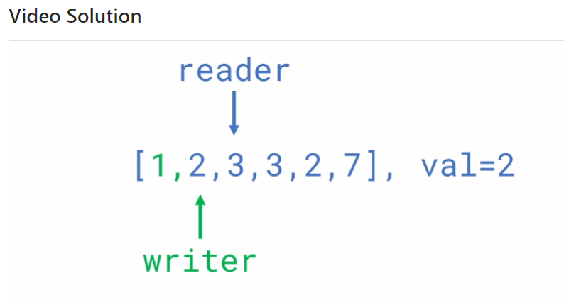

# 27. Remove Element

#### 每天摸鱼一段代码，今天是 **2022年12月5日**，第12天

#### 详情：wuff.garafox.com 

## 问题

Given an integer array `nums` and an integer `val`, remove all occurrences of `val` in `nums` **in-place**. The relative order of the elements may be changed.

Since it is impossible to change the length of the array in some languages, you must instead have the result be placed in the **first part** of the array `nums`. More formally, if there are `k` elements after removing the duplicates, then the first `k` elements of `nums` should hold the final result. It does not matter what you leave beyond the first `k` elements.

Return `k` *after placing the final result in the first* `k` *slots of* `nums`.

Do **not** allocate extra space for another array. You must do this by **modifying the input array in-place** with O(1) extra memory.

## 代码

```c
int removeElement(int* nums, int numsSize, int val){
    int rtSize = 0;
    int temp;
    
    for(int i = 0; i < numsSize; i++){
        temp = nums[i];
        if(temp != val){
            nums[rtSize] = temp;
            rtSize++;
        }
    }
    return rtSize;
}
```

## 运行

*Success*

Runtime: 3 ms, faster than 74.77% of C online submissions for Remove Element.

Memory Usage: 6.1 MB, less than 44.60% of C online submissions for Remove Element.

## 总结

This is how *two pointers* work. 


